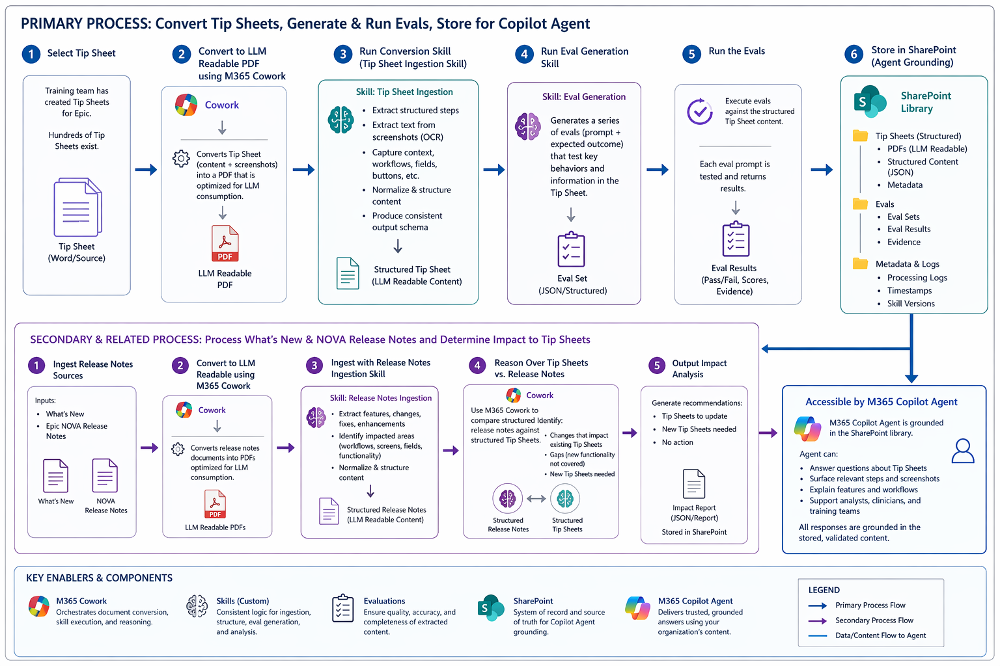

# Epic Tip Sheet Optimizer

Skills, processes, and artifacts — powered by **M365 Copilot Cowork** — for converting screenshot-heavy Epic training tip sheets into LLM-readable knowledge bases with structured eval generation and validation, so M365 Copilot agents can actually use them.

## Problem Statement

Healthcare organizations maintain thousands of Epic training tip sheets — step-by-step guides that teach staff how to perform clinical and operational workflows. These documents are heavily visual: nearly every step includes annotated screenshots with red boxes, arrows, and callout labels that carry critical contextual information.

**AI agents struggle with these documents.** Screenshots are opaque to LLMs. When a tip sheet says "click the highlighted button" and the only way to know *which* button is to read the red-boxed annotation in the screenshot, the agent is blind. Multiply this across thousands of tip sheets, and you have a knowledge base that is:

- **Unsearchable** — agents can't reason over images embedded in PDFs or Word docs
- **Inaccurate** — agents that attempt to answer from partial text hallucinate the missing visual context
- **Unmaintainable** — when Epic releases updates, there's no structured way to determine which tip sheets are impacted

This repo provides the **Copilot skills and processes** to solve this at scale.

## How It Works

The solution is a two-track process powered by **M365 Copilot Cowork** — which orchestrates document conversion, skill execution, and reasoning — combined with custom Copilot skills that handle ingestion, eval generation, and analysis.



### Primary Process: Convert Tip Sheets, Generate & Run Evals, Store for Copilot Agent

| Step | Action | Details |
|------|--------|---------|
| **1** | **Select Tip Sheet** | Choose an Epic tip sheet (Word/PDF source) for conversion |
| **2** | **Convert to LLM-Readable PDF** | Use M365 Cowork to convert the source document into an LLM-readable PDF |
| **3** | **Ingest & Structure Tip Sheet** | Run the **Training Content to Knowledge Base** skill — extracts steps and screenshots via OCR, producing a structured, LLM-readable tip sheet (Markdown and/or JSON) |
| **4** | **Run Eval Generation Skill** | Generate a 20-question eval set (JSON) with expected answers and scoring rubrics across 5 categories |
| **5** | **Validate Content Accuracy** | Run the **Eval Runner** skill — executes the eval against the structured content, producing a scorecard with pass/fail, category breakdowns, and per-question results |
| **6** | **Store in SharePoint** | Publish the validated tip sheet and eval data to a SharePoint library where M365 Copilot and/or WallE agents are grounded |

### Secondary & Related Process: Process What's New & NOVA Release Notes and Determine Impact to Tip Sheets

| Step | Action | Details |
|------|--------|--------|
| **1** | **Ingest Release Notes Sources** | Collect What's New updates and Epic NOVA release notes |
| **2** | **Convert to LLM-Readable using M365 Cowork** | Cowork converts release notes documents into PDFs optimized for LLM consumption |
| **3** | **Ingest with Release Notes Ingestion Skill** | Extract features, changes, fixes, and enhancements; identify impacted areas (workflows, screens, fields, functionality); normalize and structure content |
| **4** | **Reason Over Tip Sheets vs. Release Notes** | Use M365 Cowork to compare structured release notes against structured tip sheets — identify changes that impact existing tip sheets, gaps (new functionality not covered), and new tip sheets needed |
| **5** | **Output Impact Analysis** | Generate recommendations: tip sheets to update, new tip sheets needed, or no action — stored as an impact report (JSON/Report) in SharePoint |

### Accessible by M365 Copilot Agent

The M365 Copilot Agent is grounded in the SharePoint library and can:

- Answer questions about tip sheets
- Surface relevant steps and screenshots
- Explain features and workflows
- Support analysts, clinicians, and training teams

All responses are grounded in the stored, validated content.

### Key Enablers & Components

| Component | Role |
|-----------|------|
| **M365 Cowork** | Orchestrates document conversion, skill execution, and reasoning |
| **Skills (Custom)** | Consistent logic for ingestion, structure, eval generation, and analysis |
| **Evaluations** | Ensure quality, accuracy, and completeness of extracted content |
| **SharePoint** | System of record and source of truth for Copilot Agent grounding |
| **M365 Copilot Agent** | Delivers trusted, grounded answers using your organization's content |

## Repository Structure

```
├── Assets/                          # Process diagrams and visual assets
│   └── TipSheetEndtoEnd.png         # End-to-end process overview
├── Skills/                          # Copilot skills (SKILL.md files)
│   ├── training-content-to-knowledge-base/
│   │   └── SKILL.md                 # Converts tip sheets → LLM-readable content + evals
│   └── eval-runner/
│       └── SKILL.md                 # Runs evals against content, produces scorecards
├── CODE_OF_CONDUCT.md
├── CONTRIBUTING.md
├── LICENSE                          # MIT License
├── SECURITY.md
└── README.md
```

## Skills

### Training Content to Knowledge Base

Converts training tip sheets (typically PDFs with annotated screenshots) into structured, LLM-readable knowledge base content. Performs page-by-page verbatim extraction with strict zero-hallucination rules, generates ENUMs for constrained value sets, and respects annotation boundaries (what's inside vs. outside a red box). Optionally generates a 20-question eval set across 5 categories.

**[View Skill →](Skills/training-content-to-knowledge-base/SKILL.md)**

### Eval Runner

Runs a structured eval against LLM-readable content to measure how well an LLM can reason over it. Uses a two-stage approach (blind answer → informed grade) to prevent answer leakage. Produces a detailed scorecard with per-question grades, category breakdowns, hallucination flags, and pass/fail results.

**[View Skill →](Skills/eval-runner/SKILL.md)**

## Getting Started

1. **Clone this repo**
   ```bash
   git clone https://github.com/martycarreras-psnl/Epic-Tip-Sheet-Optimizer.git
   ```

2. **Install the skills** into your Copilot environment by copying the `Skills/` folder into your workspace's skill directory (e.g., `~/.copilot/skills/`)

3. **Prepare your tip sheet** — place the source PDF into an `input/` folder in your working directory

4. **Run the ingestion skill** — ask Copilot to "convert this tip sheet to an LLM-readable knowledge base" and the skill will guide the process

5. **Run the eval** — ask Copilot to "run the eval" against the generated content to validate quality

## Contributing

See [CONTRIBUTING.md](CONTRIBUTING.md) for guidelines on submitting skills, improvements, and bug reports.

## License

This project is licensed under the MIT License — see [LICENSE](LICENSE) for details.

## Code of Conduct

This project has adopted the [Microsoft Open Source Code of Conduct](https://opensource.microsoft.com/codeofconduct/). See [CODE_OF_CONDUCT.md](CODE_OF_CONDUCT.md) for details.

## Security

For security reporting guidance, see [SECURITY.md](SECURITY.md).
